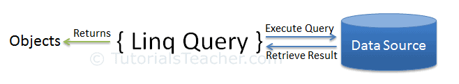

## What is LINQ?
LINQ is a standard query syntax in C# that abstracts the logic of retrieving data.



The datasource could be a variety of things, here's just a few: 
* A list
* An object
* JSON
* A database

## Query Syntax vs Method Syntax

### Query Syntax:
```C#
var names = new List<string>() { 
    "Shawn",
    "Gus"
};

var result = from name in names
            where name.Contains("Shawn") 
            select name;
```

### Method Syntax:
```C#
var names = new List<string>() { 
    "Shawn",
    "Gus"
};

var result = names.Where(name => name.Contains("Shawn"));
```


# Why use LINQ?
* Standard, familiar language
* More readable
* Type safety
  
  
## Which is easer to understand?
### Option 1: For Loop
  ```C#
  var students = { 
        new Student() { StudentID = 1, StudentName = "John", Age = 18 },
        new Student() { StudentID = 2, StudentName = "Steve",  Age = 21 },
        new Student() { StudentID = 3, StudentName = "Bill",  Age = 25 },
        new Student() { StudentID = 4, StudentName = "Ram" , Age = 20 },
        new Student() { StudentID = 5, StudentName = "Ron" , Age = 31 },
        new Student() { StudentID = 6, StudentName = "Chris",  Age = 17 },
        new Student() { StudentID = 7, StudentName = "Rob",Age = 19  },
    };

    var newStudents = new Student[10];

    int i = 0;

    foreach (Student std in newStudents)
    {
        if (std.Age > 12 && std.Age < 20)
        {
            newStudents[i] = std;
            i++;
        }
    }
```

### Option 2: LINQ
```C#
var students = { 
        new Student() { StudentID = 1, StudentName = "John", age = 18 } ,
        new Student() { StudentID = 2, StudentName = "Steve",  age = 21 } ,
        new Student() { StudentID = 3, StudentName = "Bill",  age = 25 } ,
        new Student() { StudentID = 4, StudentName = "Ram" , age = 20 } ,
        new Student() { StudentID = 5, StudentName = "Ron" , age = 31 } ,
        new Student() { StudentID = 6, StudentName = "Chris",  age = 17 } ,
        new Student() { StudentID = 7, StudentName = "Rob",age = 19  } ,
    };

    var teenagerStudents = students.Where(s => s.age > 12 && s.age < 20);
```

## Common LINQ Operators
```C#
var students = { 
        new Student() { StudentID = 1, StudentName = "John", age = 18 } ,
        new Student() { StudentID = 2, StudentName = "Steve",  age = 21 } ,
        new Student() { StudentID = 3, StudentName = "Bill",  age = 25 } ,
        new Student() { StudentID = 4, StudentName = "Ram" , age = 20 } ,
        new Student() { StudentID = 5, StudentName = "Ron" , age = 31 } ,
        new Student() { StudentID = 6, StudentName = "Chris",  age = 17 } ,
        new Student() { StudentID = 7, StudentName = "Rob",age = 19  } ,
    };

var teenagerStudents = students.Where(s => s.age > 12 && s.age < 20);
var studentsOrdered = students.OrderByDescending(s => s.age);
var averageAge = students.Average(s => s.age);
var studentCount = students.Count();
var uniqueStudents = students.Discount();

```

## Exercises
A few exercises are found in `Exercises.cs`.

To run, pull down the repo and run `dotnet run` at the root.

## Feedback
https://forms.gle/Vbx1hiszfV9sKQkZ8
